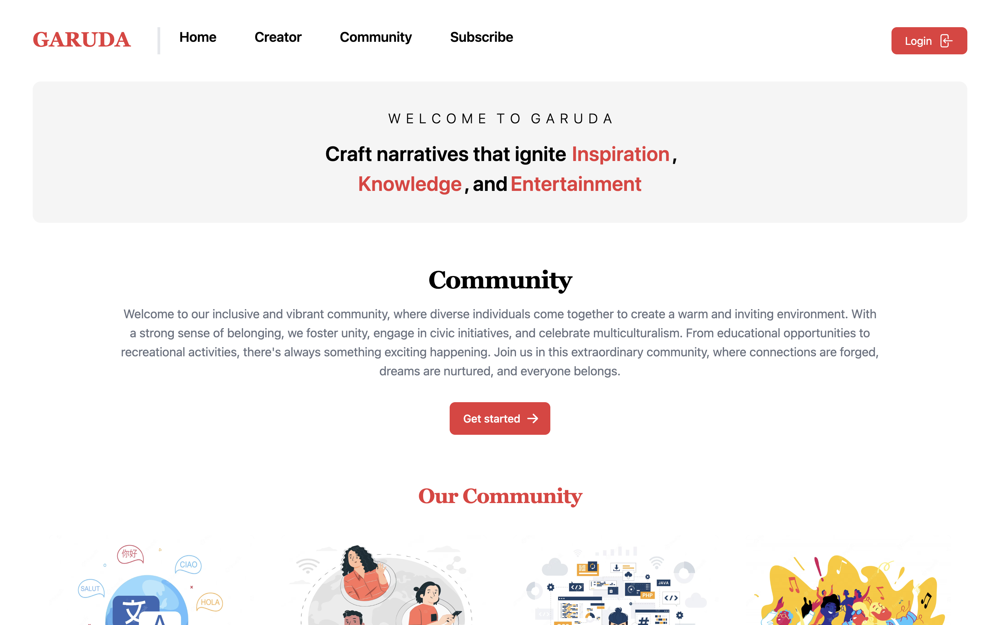
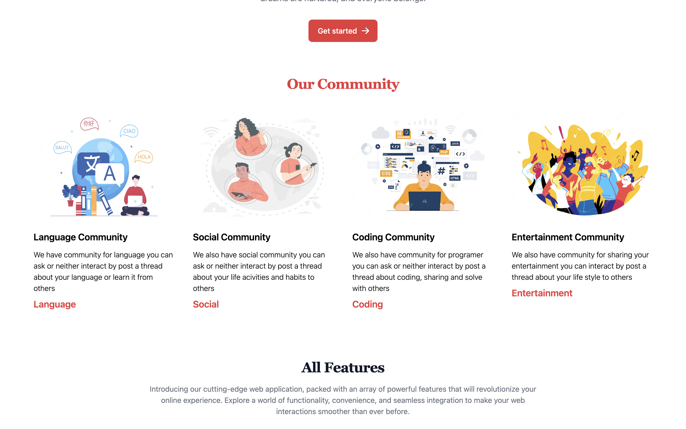
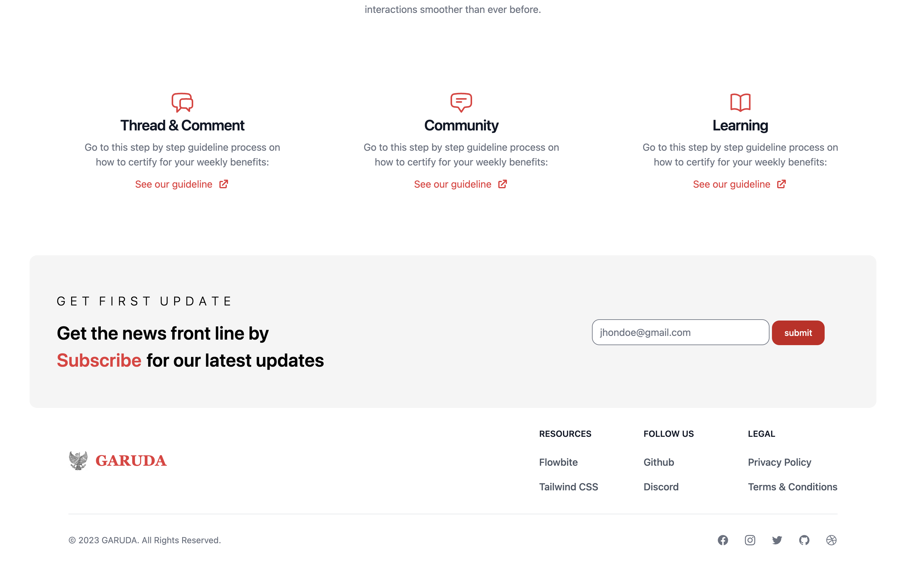
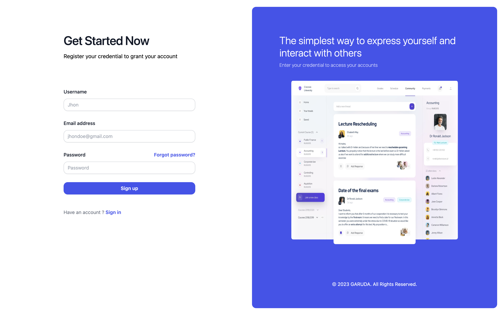
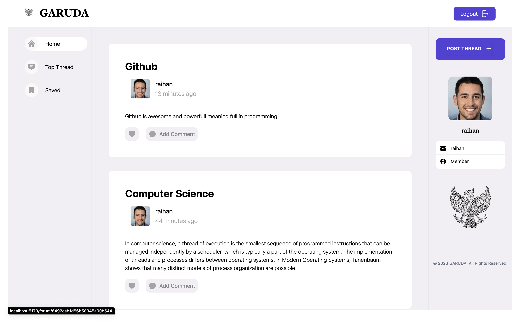
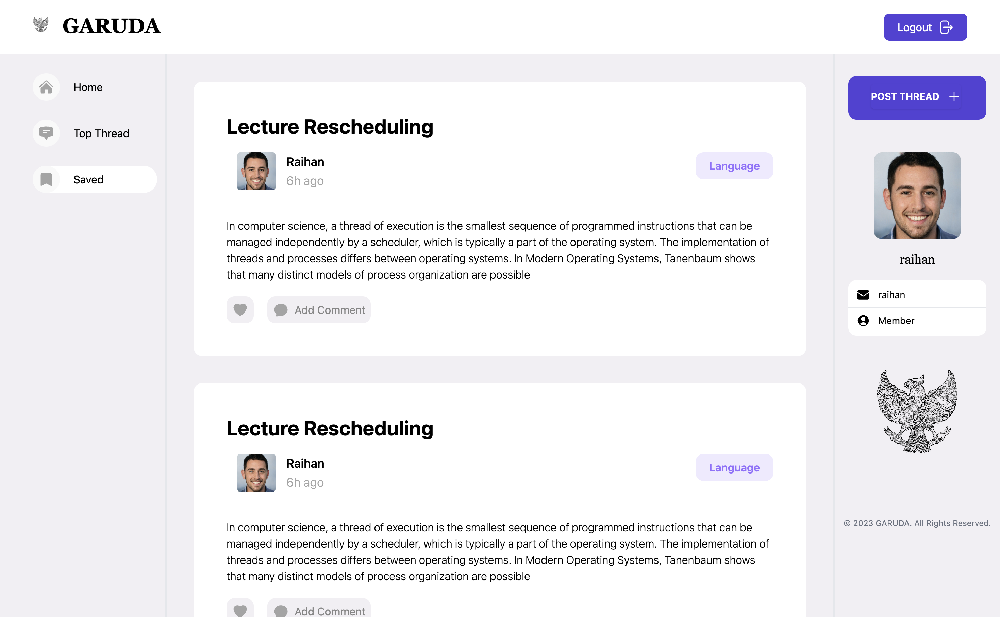
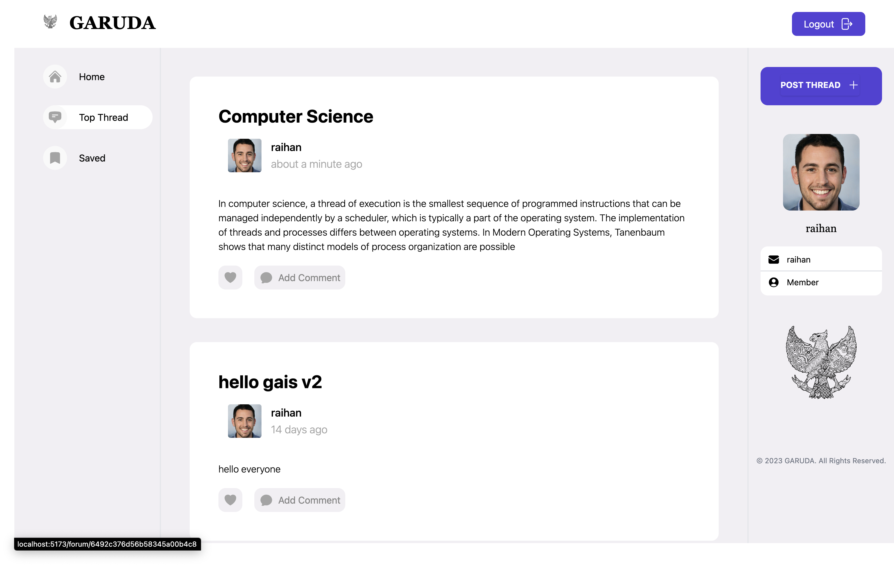
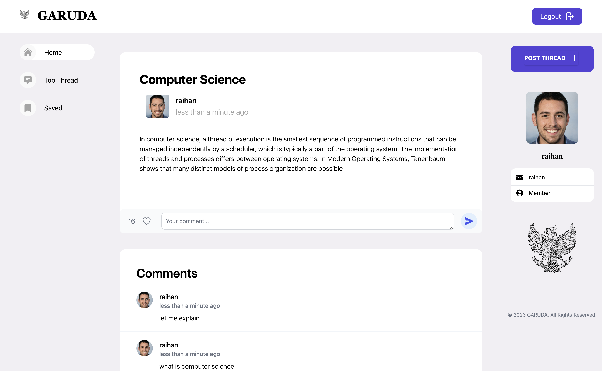
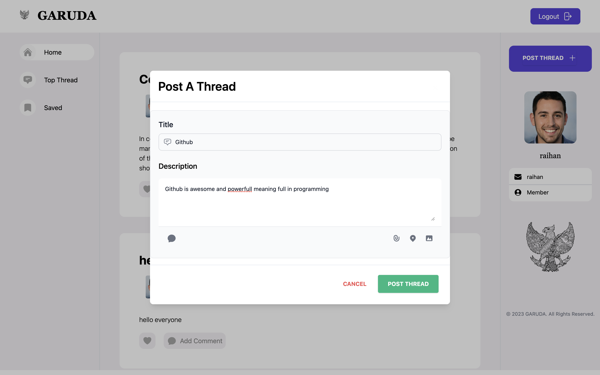

# GARUDA Forum

## Back - End URL
- https://github.com/teten-nugraha/forum-services

## Description

I am excited to introduce my latest project, 'Garuda Forum,' a dynamic, user-friendly forum developed using the powerful React library. Garuda Forum is designed to provide a platform for users to interact, share ideas, and engage in enriching discussions through threads.

The focus of Garuda Forum is on creating a seamless and interactive user experience. Leveraging the features of React, the forum provides high performance, maintains a light footprint, and offers an intuitive user interface. The use of React also allows for efficient updates and rendering of components, ensuring a smooth, real-time conversation flow.

This project demonstrates my dedication to creating meaningful user experiences and pushing the envelope in software development. It combines key elements of modern web development, including a single-page application architecture and the use of state management techniques to manage a large number of user interactions in real-time.

## Team

### Member

* [Raihan aqil fadillah](https://github.com/hansss12) as Front - End
* [Teten Nugraha](https://github.com/teten-nugraha) as Back - End

### Contribution

I am contributing as a Front-End Developer, leveraging my skills in HTML, CSS, JavaScript, and ReactJS to create an intuitive and responsive user interface. My focus is to ensure an engaging, user-friendly experience, making complex functionalities accessible and simple for our users.

Teten Nugraha in this venture serves as the Back-End Developer, working magic with languages such as Java and Node.js, and managing databases effectively using MongoDB. he's contribution enables the efficient handling of data and ensures the seamless functioning of the application behind the scenes.

Together, we bridge the gap between user interactions and server responses, creating a holistic, full-stack experience. This project showcases our synergistic collaboration, combining front-end flair with back-end robustness, to develop applications that are not just functional, but also engaging and user-friendly.

## Preview

* Landing Page

 

 

* Login / Register

 

* Forum Home 

 

* Forum Saved

 

* Forum Top

 

* Comment Thread

 

* Post Thread

 

#### Project v1 finished at 12 - 06 - 2023